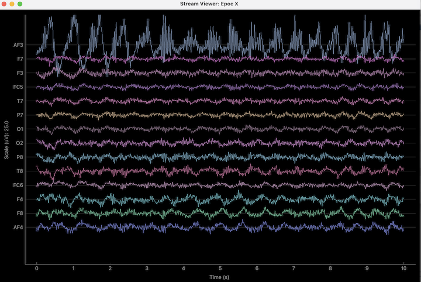

# emotiv-lsl

LSL server for Emotiv EPOC X  
Original code taken from [CyKit](https://github.com/CymatiCorp/CyKit)

### Dependencies

```
pip install pipenv
python -m pipenv install
```

### Usage
Disable the motion data in Emotiv app settings  
Connect dongle, turn on the headset, wait for the light from two indicators
```
# frist terminal
python -m pipenv run python main.py
```

Then you can use any lsl client, for example [bskl](https://github.com/bsl-tools/bsl)

```
bsl_stream_viewer
```



Or use examples/read_data.py to get raw data

```
# second terminal
python -m pipenv run python examples/read_data.py
```

### Config

Change device sampling rate in config.py and emotiv app

### Examples

Get raw data:

```
python main.py & # start lsl server
python examples/read_data.py # get raw data
[4179.35888671875, 4320.5126953125, 4263.84619140625, 4311.53857421875, 4393.58984375, 4347.56396484375, 4371.41015625, 4549.4873046875, 4511.9228515625, 4434.1025390625, 4378.46142578125, 5053.33349609375, 4283.33349609375, 4228.46142578125] 104573.455064594
[4163.33349609375, 4318.0771484375, 4258.7177734375, 4310.384765625, 4396.41015625, 4350.384765625, 4374.615234375, 4550.76904296875, 4508.0771484375, 4429.4873046875, 4374.4873046875, 5058.205078125, 4274.4873046875, 4222.94873046875] 104573.457074205
[4164.615234375, 4316.02587890625, 4255.384765625, 4312.3076171875, 4398.0771484375, 4350.12841796875, 4376.15380859375, 4552.94873046875, 4513.97412109375, 4430.8974609375, 4375.384765625, 5063.7177734375, 4275.384765625, 4225.0] 104573.464060118
[4177.94873046875, 4321.66650390625, 4261.794921875, 4313.46142578125, 4397.1796875, 4347.05126953125, 4373.58984375, 4551.66650390625, 4521.2822265625, 4436.794921875, 4378.7177734375, 5060.76904296875, 4283.7177734375, 4232.8203125] 104573.472085895
```

Write raw data via mne to .fif:

```
python main.py & # start lsl server
python examples/read_and_export_mne.py # write raw data to fif file
Ready.
Writing emotiv-lsl/data_2023-09-20 18:36:10.775860_raw.fif
Closing emotiv-lsl/data_2023-09-20 18:36:10.775860_raw.fif
```
